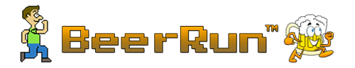

## How to play Beer Run locally

#### In your terminal run the following commands

1. Clone Repository

   <pre><code>git clone git@github.com:althe1/beerRun.git</code></pre>

2. Npm Install:

   <pre><code>npm install</code></pre>

3. Npm Build:

   <pre><code>npm run build</code></pre>

4. Run Server:
   <pre><code>npm start</code></pre>

### Created By:

- [Mariano Echegoyen](https://github.com/Mariano89)
- [Alfred Kirakosian](https://github.com/althe1)
